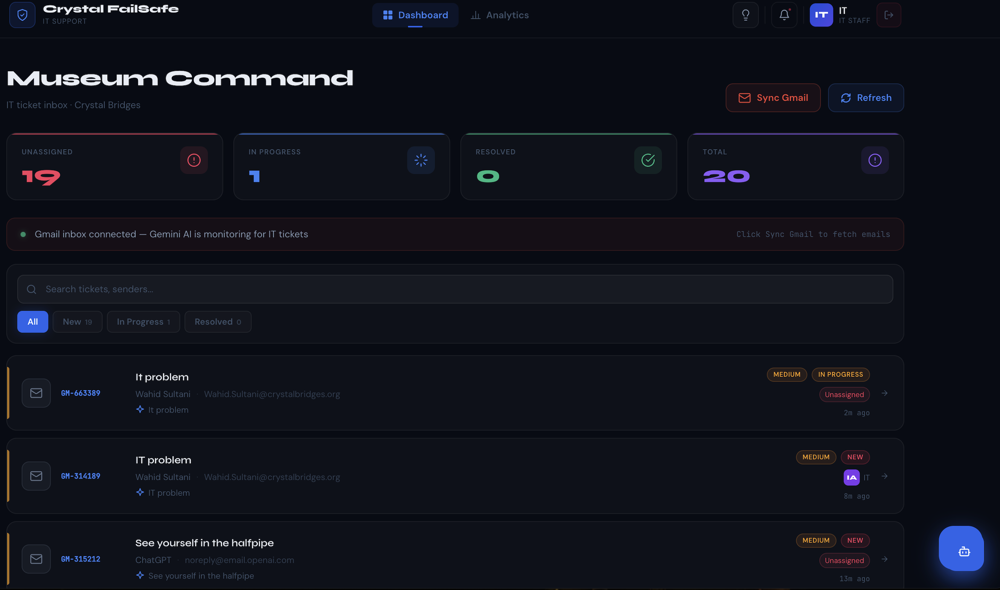
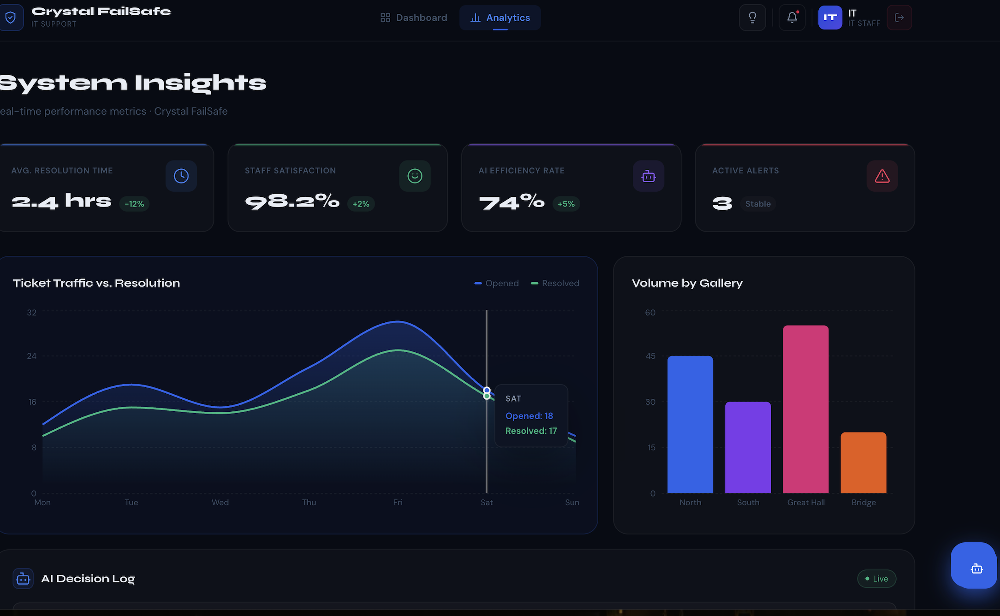

# 🔮 Crystal FailSafe

An AI-powered IT helpdesk ticketing system built for **Crystal Bridges Museum of American Art**. The system automatically monitors a Gmail inbox, uses Google Gemini AI to identify IT support emails, and creates tickets in a real-time dashboard for staff to manage and resolve.

> ⚠️ **Note:** This app requires a running backend and database to function. See [Local Setup](#️-setup--installation) below to run it locally.

---

## 🌐 Live Demo (Frontend Only)

**[crystal-fail-safe.vercel.app](https://crystal-fail-safe.vercel.app)**

> The live link shows the frontend UI. To see the full app in action, see the screenshots below or follow the local setup guide.

---

## 📸 Screenshots

### Dashboard


### Analytics


---

## ✨ Features

- 📬 **Gmail Integration** — Connects to Gmail via OAuth2 and syncs incoming emails automatically
- 🤖 **Gemini AI Analysis** — Uses Google Gemini 1.5 Flash to determine if an email is an IT issue, then categorizes it by type and priority
- 🎫 **Auto Ticket Creation** — IT emails are automatically converted into tickets stored in a MySQL database
- 📊 **Live Dashboard** — Real-time stats for unassigned, in-progress, resolved, and total tickets
- 👥 **Staff Assignment** — Assign tickets to approved staff members and track progress
- 🔍 **Search & Filter** — Search tickets by subject or sender, filter by status
- 🛡️ **Admin Panel** — Admins can approve, reject, delete users and change staff roles
- 🔐 **Authentication** — JWT-based login with role-based access and admin approval flow
- 📧 **Email Notifications** — Automatic emails sent on signup, approval, and rejection
- 🌙 **Dark / Light Mode** — Full theme support across all pages
- 📈 **Analytics Page** — Visual breakdown of ticket trends and categories

---

## 🛠 Tech Stack

**Frontend**
- React (Vite)
- Framer Motion
- React Router
- Recharts
- Custom CSS with glass-morphism design

**Backend**
- Node.js + Express
- MySQL (via `mysql2`)
- Google Gmail API (OAuth2)
- Google Gemini AI (`gemini-1.5-flash`)
- JWT Authentication
- Nodemailer (email notifications)

---

## 📁 Project Structure

```
Crystal-FailSafe/
├── backend/
│   ├── src/
│   │   ├── config/
│   │   │   ├── db.js
│   │   │   ├── migrate.js
│   │   │   └── seed.js
│   │   ├── controllers/
│   │   │   ├── adminController.js
│   │   │   ├── authController.js
│   │   │   ├── gmailController.js
│   │   │   └── ticketsController.js
│   │   ├── middleware/
│   │   │   └── auth.js
│   │   ├── routes/
│   │   │   ├── auth.js
│   │   │   ├── tickets.js
│   │   │   ├── admin.js
│   │   │   └── gmailRoutes.js
│   │   ├── utils/
│   │   │   └── email.js
│   │   └── server.js
│   ├── .env
│   └── package.json
└── frontend/
    ├── src/
    │   ├── components/
    │   ├── context/
    │   ├── pages/
    │   ├── api.js
    │   ├── App.jsx
    │   └── main.jsx
    └── package.json
```

---

## ⚙️ Setup & Installation

### 1. Clone the repository

```bash
git clone https://github.com/Wahid123542/Crystal-FailSafe.git
cd Crystal-FailSafe
```

### 2. Backend Setup

```bash
cd backend
npm install
```

Create a `.env` file in the `backend/` folder:

```env
PORT=8000
NODE_ENV=development

DB_HOST=localhost
DB_PORT=3306
DB_USER=root
DB_PASSWORD=yourpassword
DB_NAME=crystal_failsafe

JWT_SECRET=your_jwt_secret
JWT_EXPIRES_IN=7d

EMAIL_HOST=smtp.gmail.com
EMAIL_PORT=587
EMAIL_USER=your@gmail.com
EMAIL_PASS=your_app_password
EMAIL_FROM=Crystal FailSafe <your@gmail.com>

FRONTEND_URL=http://localhost:5173

GEMINI_API_KEY=your_gemini_api_key
GMAIL_CLIENT_ID=your_gmail_client_id
GMAIL_CLIENT_SECRET=your_gmail_client_secret
GMAIL_REDIRECT_URI=http://localhost:8000/api/gmail/callback
GMAIL_REFRESH_TOKEN=your_gmail_refresh_token
```

Start the backend:

```bash
cd src
node server.js
```

### 3. Frontend Setup

```bash
cd frontend
npm install
npm run dev
```

Visit `http://localhost:5173` in your browser.

---

## 🔑 Gmail OAuth Setup

1. Go to [Google Cloud Console](https://console.cloud.google.com/)
2. Create a new project and enable the **Gmail API**
3. Create OAuth 2.0 credentials (Web Application)
4. Add `http://localhost:8000/api/gmail/callback` as a redirect URI
5. Copy your Client ID and Client Secret to `.env`
6. Visit `http://localhost:8000/api/gmail/auth-url` to authorize and get your refresh token
7. Add the refresh token to your `.env`

---

## 🤖 How the AI Works

When you click **Sync Gmail**, the backend:

1. Fetches emails from all folders (including spam) from the last 24 hours
2. Sends each email's subject and body to **Gemini 1.5 Flash**
3. Gemini returns a JSON response with:
   - `is_ticket` — whether it's an IT issue
   - `summary` — a one-line technical summary
   - `category` — hardware / software / network / account / access / other
   - `priority` — urgent / high / medium / low
4. If `is_ticket` is true, a ticket is created in the database and shown on the dashboard

---

## 🛡️ Admin Panel

Admins have access to a dedicated admin panel at `/admin`.

**How the approval flow works:**
1. A staff member signs up at `/signup`
2. They receive a confirmation email saying their account is pending
3. All admins receive an email alert about the new signup
4. Admin logs in, goes to the Admin panel, and approves or rejects the request
5. The staff member receives an approval or rejection email
6. Approved staff can now log in

**To create your first admin manually:**
```sql
UPDATE users SET role = 'admin', status = 'approved' WHERE email = 'your@email.com';
```

---

## 📡 API Endpoints

| Method | Endpoint | Description |
|--------|----------|-------------|
| POST | `/api/auth/signup` | Register a new user |
| POST | `/api/auth/login` | Login |
| GET | `/api/auth/me` | Get current user |
| POST | `/api/auth/forgot-password` | Send password reset email |
| POST | `/api/auth/reset-password` | Reset password with token |
| GET | `/api/tickets` | Get all tickets |
| POST | `/api/tickets` | Create a ticket |
| PATCH | `/api/tickets/:id` | Update ticket status/assignment |
| GET | `/api/admin/users` | Get all users (admin only) |
| PATCH | `/api/admin/users/:id/approve` | Approve a user (admin only) |
| PATCH | `/api/admin/users/:id/reject` | Reject a user (admin only) |
| PATCH | `/api/admin/users/:id/role` | Change user role (admin only) |
| DELETE | `/api/admin/users/:id` | Delete a user (admin only) |
| GET | `/api/gmail/auth-url` | Get Gmail OAuth URL |
| GET | `/api/gmail/callback` | Gmail OAuth callback |
| POST | `/api/gmail/sync` | Sync Gmail and create tickets |

---

## 📄 License

This project is open source and available under the [MIT License](LICENSE).

> **Disclaimer:** This project is a personal portfolio project and is not affiliated with, endorsed by, or connected to Crystal Bridges Museum of American Art in any way. The museum name was used purely as an inspiration for the project concept.
